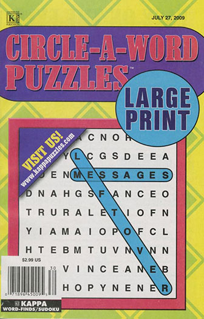
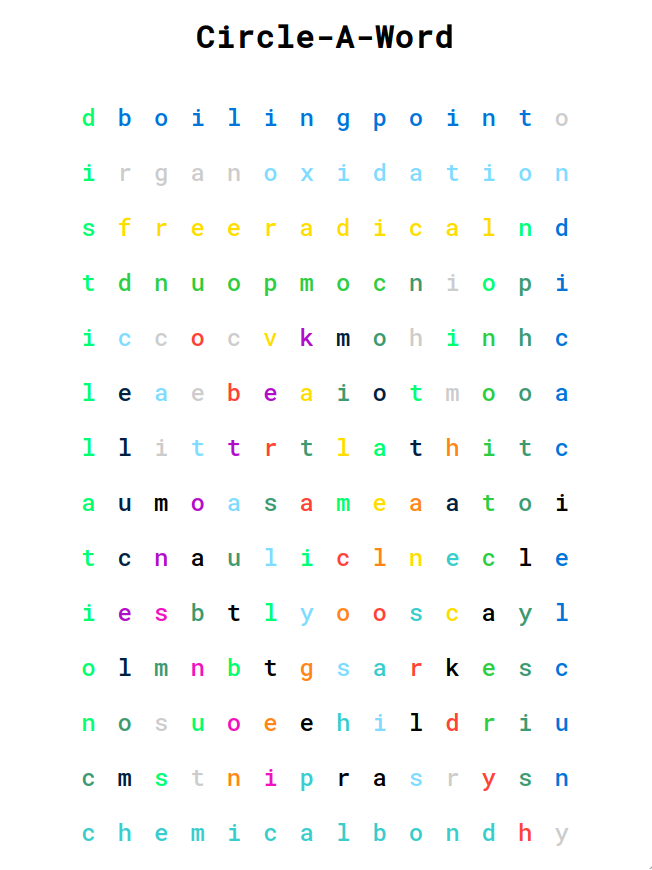

# Circle-A-Word

Inspired by the Circle-A-Word puzzles





## Rules

You are given a grid and a list of words. The words are contained in the grid and can be found in either:
* right
* down right
* down
* down left
* left
* up left
* up
* up right

The letters must be contiguous. No wrapping.

## Technical Solution

The entrypoint is `solver.walk()` which will first sanitize the words (lowercase, remove spaces) and build a grid.

Next we loop over the words, and call `findWord`. This does a brute force calculation by checking the one letter at a time against each grid entry. If a match is found, a strategy is used to try each direction from that letter.

If a match is found, we recursively call `check` for the next letter, and so on until we find the complete word, or hit a letter that doesn't match. In which case we call the next strategy, and then move on to the next grid entry and start again.

A `solver.toHTML()` function is provided to dump the solution to an HTML `<table>` with some basic data attributes for styling purposes.

## Webserver

```
npm run server
```

## Testing

```
npm test
```

(or for interactive debugging)

```
mocha inspect
```

## Why Did I Make This?

I needed to take my mind off of having my appendix removed so I jumped into a puzzle book. After a few rounds I started to see the pattern and decided to try and build this solver.

It has been a lot of fun and I learned a bit more about Pug, recursion, and CSS flex.

## Copyright

Copyright 2020 Ben Simpson

Permission is hereby granted, free of charge, to any person obtaining a copy of this software and associated documentation files (the "Software"), to deal in the Software without restriction, including without limitation the rights to use, copy, modify, merge, publish, distribute, sublicense, and/or sell copies of the Software, and to permit persons to whom the Software is furnished to do so, subject to the following conditions:

The above copyright notice and this permission notice shall be included in all copies or substantial portions of the Software.

THE SOFTWARE IS PROVIDED "AS IS", WITHOUT WARRANTY OF ANY KIND, EXPRESS OR IMPLIED, INCLUDING BUT NOT LIMITED TO THE WARRANTIES OF MERCHANTABILITY, FITNESS FOR A PARTICULAR PURPOSE AND NONINFRINGEMENT. IN NO EVENT SHALL THE AUTHORS OR COPYRIGHT HOLDERS BE LIABLE FOR ANY CLAIM, DAMAGES OR OTHER LIABILITY, WHETHER IN AN ACTION OF CONTRACT, TORT OR OTHERWISE, ARISING FROM, OUT OF OR IN CONNECTION WITH THE SOFTWARE OR THE USE OR OTHER DEALINGS IN THE SOFTWARE.